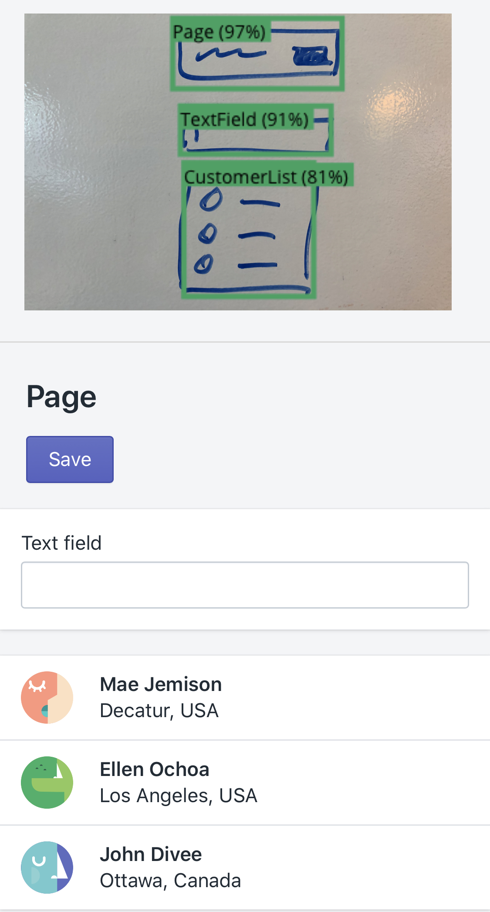

# Polaris Whiteboarder

This experiment creates simple Polaris prototypes from wireframes drawn on a whiteboard. It has many flaws but was fun to work on.

## How it works

1. [Training data](https://github.com/kvendrik/polaris-ml/tree/master/training-data) is uploaded to [IBM Cloud Annotations](https://cloud.annotations.ai) and labeled so the machine knows what components are visible in the images.
2. We use a [Watson Machine Learning](https://dataplatform.cloud.ibm.com/docs/content/wsj/analyze-data/ml-overview.html) instance to train a model using this training data.
3. We download this [newly trained model](https://github.com/kvendrik/polaris-ml/tree/master/public/model) and store it with the front-end (this repository).
4. The front-end then uses a utility that's based on [Tensorflow.js](https://www.tensorflow.org/js) (highly derived from [IBM's object detection library](https://github.com/cloud-annotations/object-detection-js)) to (client-side) detect prototype-friendly [Polaris](https://polaris.shopify.com/) components in a given image.

This flow is based on [IBM's object detection walkthrough](https://cloud-annotations.github.io/training/object-detection/cli/index.html).
